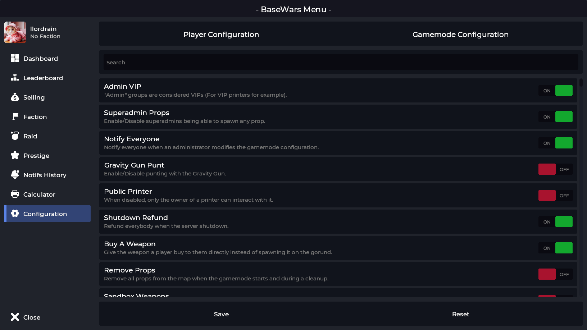

- The gamemode config is in game in the BaseWars Menu (F3)
  - The "normal" configs such as Payday, Respawn time, XP multiplier and all may only be change there.
  - By default only "_superadmin_" have access to the config. If you wish to add more usergroups search for the config "_Superadmins_". 

<!--  -->

- The MySQL config is in [config/MySQL.lua](../../gamemode/config/MySQL.lua)

  - Heres the link for [MySQLOO](https://github.com/FredyH/MySQLOO) if you want to use it

- The BaseWars Shop (F4) config is in [config/entities.lua](../../gamemode/config/entities.lua)
  - The documentation for how to configure it is [Here](../shop/shop.md)
